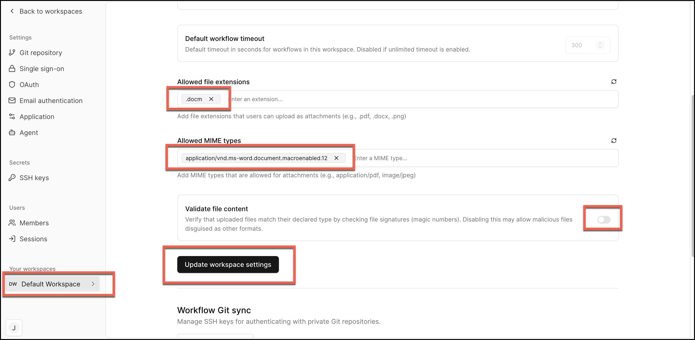

# Workflow Setup for Alert Enrichment Automation with OpenAI 

This workflow will create a case and allow you to add an attachment for alert enrichment automated summarization.

1. Upload the workflow: ```alert-enrichment.yaml```
2. Register and add the following API Keys:
   - Secret Name: ```openai```; Secret keys:  ```OPENAI_API_KEY```; Website: https://platform.openai.com
   - Secret Name: ```sublime```; Secret keys:  ```SUBLIME_API_KEY```; Website: https://platform.sublime.security
   - Secret Name: ```urlscan```; Secret keys:  ```URLSCAN_API_KEY```; Website: https://urlscan.io/
   - Secret Name: ```virustotal```; Secret keys:  ```VIRUSTOTAL_API_KEY```; Website: https://www.virustotal.com
    
4. Go into your Default Workspace settings as shown in the image.  You will then allow file extensions and mime types.
5. Add a file extension such as ```.docm```
6. Add Allowed MIME types such as ```application/vnd.ms-word.document.macroenabled.12```
7. Toggle off the ```Validate file content```
8. Click ```Upldate workspace settings```


